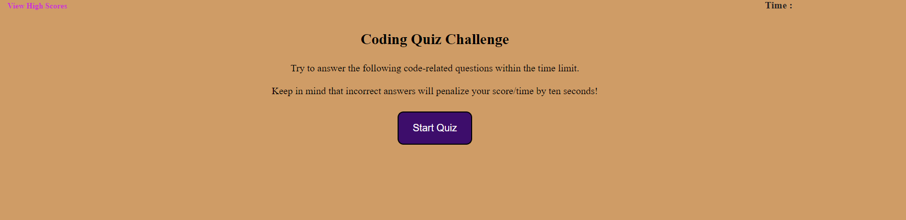
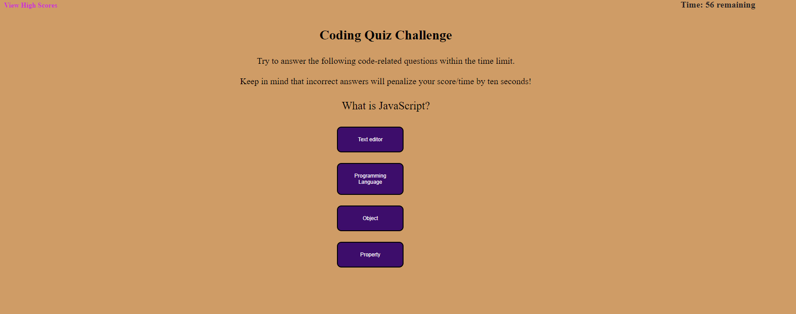
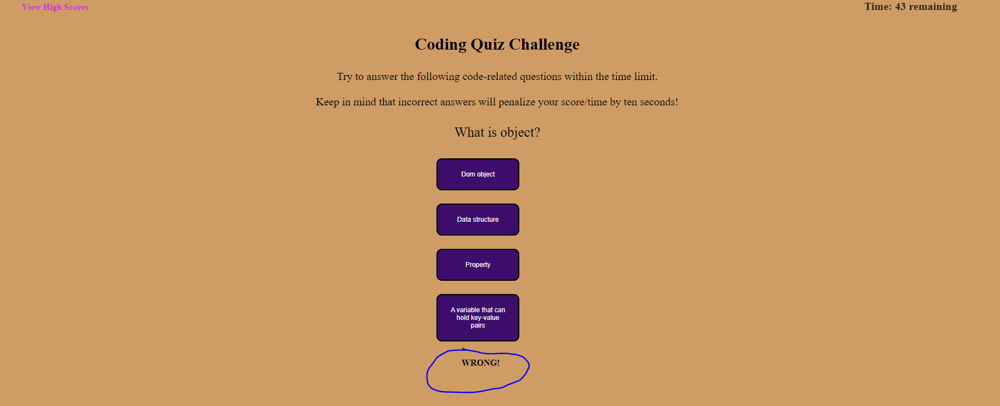
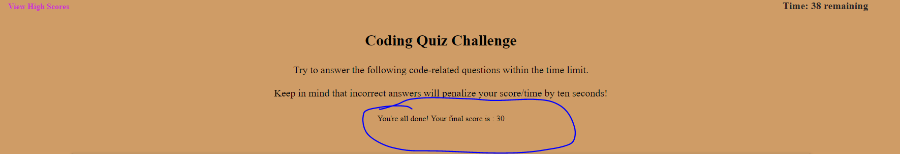

# 04-quiz-game
This is a timed quiz game application using JavaScript

## I added some of the following items:  
 

- Added functions
- Added if statements
- Added event listeners
- Created arrays of objects
- Created foo loops
- Created variables to manipulate the DOM
- Refactored code

## Sreenshots of the web page ##

## Links ##
- GitHub Repository
(https://github.com/noviceprogrammeroh/04-quiz-game)

- GitHub Pages
(https://noviceprogrammeroh.github.io/04-quiz-game/)